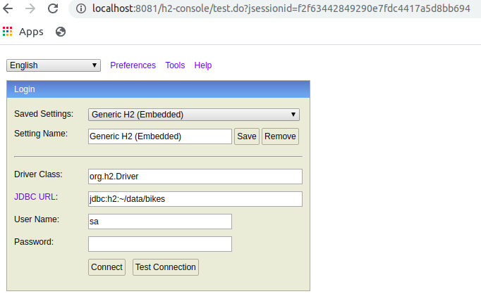

# Spring Boot to generate bikes

This module generates bikes to be injected in the backend application. 
It provides endpoints to:

- generate a given number of bikes and store in an H2 database
- clean up all the generated bikes
- call the creation service of a given backend endpoint for all generated bikes

## Getting started

1. Build & Test via Gradle

```shell script
cd backend/java
./gradlew :bike-generator:build
``` 
2. Run Spring Boot Application

```shell script
cd backend/java
./gradlew ./gradlew :bike-generator:build
java -jar ./bike-generator/build/libs/bike-generator-1.0-SNAPSHOT.jar
```

## Generate bikes and store them in the H2 database

Run the following curl to create 10 bikes:

```shell script
curl --request POST \
  --url http://localhost:8081/bikes \
  --header 'content-type: application/json' \
  --data '{
	"numberOfBikes": 10
}'
```

## Delete all bikes

Run the following curl:

```shell script
curl --request POST \
  --url http://localhost:8081/bikes \
  --header 'content-type: application/json' \
  --data '{
	"numberOfBikes": 10
}'
```

## Find all bikes

Run the following curl to get the first page of bikes (by default the size of a page = 20):

```shell script
curl --request GET \
  --url 'http://localhost:8081/bikes?page=0'
```

Run the following curl to get the second page of bikes with 10 results per page:

```shell script
curl --request GET \
  --url 'http://localhost:8081/bikes?page=1&size=10'
```

## Visualize generated bikes in database

The H2 console is activated in the `application.properties` via `spring.h2.console.enabled=true` 
so that the bikes can be visualized in `http://localhost:8081/h2-console`:


