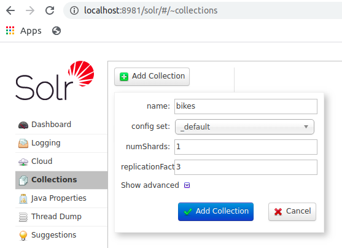

# Spring Boot with Solr

This module implements the "Choice of bike" feature on the backend server side.
It retrieves via the HTTP REST API the necessary data to be displayed on the website.

It uses Spring Boot and Spring Data Solr 2.2.6, Solr 8.5.0 and ZooKeeper 3.6.0.

The build is done via Gradle Kotlin.

## Solr configuration

A cluster of 3 ZooKeeper and 3 Solr nodes is created via a `docker-compose.yml` file. 
The embedded ZooKeeper in Solr is not used as it is not recommended for performances and memory issues.
The `ZK_HOST` variable is set, so the Solr nodes will launch in `cloud` mode. 

## Getting started

1. Build & Test via Gradle

```shell script
cd backend/java
./gradlew :spring-boot-solr:build
``` 

2. Run your Solr Cloud

```shell script
docker-compose up -d
```

3. Check that Solr is running

```shell script
docker ps -a

CONTAINER ID                IMAGE               COMMAND                  CREATED             STATUS              PORTS                                                  NAMES
<container_id_solr3>        solr:8.5            "docker-entrypoint.s…"   xx minutes ago      Up xx minutes       0.0.0.0:8983->8983/tcp                                 solr3
<container_id_solr1>        solr:8.5            "docker-entrypoint.s…"   xx minutes ago      Up xx minutes       0.0.0.0:8981->8983/tcp                                 solr1
<container_id_solr2>        solr:8.5            "docker-entrypoint.s…"   xx minutes ago      Up xx minutes       0.0.0.0:8982->8983/tcp                                 solr2
<container_id_zoo2>         zookeeper:3.6       "/docker-entrypoint.…"   xx minutes ago      Up xx minutes       2888/tcp, 3888/tcp, 8080/tcp, 0.0.0.0:2182->2181/tcp   zoo2
<container_id_zoo3>         zookeeper:3.6       "/docker-entrypoint.…"   xx minutes ago      Up xx minutes       2888/tcp, 3888/tcp, 8080/tcp, 0.0.0.0:2183->2181/tcp   zoo3
<container_id_zoo1>         zookeeper:3.6       "/docker-entrypoint.…"   xx minutes ago      Up xx minutes       2888/tcp, 3888/tcp, 0.0.0.0:2181->2181/tcp, 8080/tcp   zoo1
```

Volumes:
 
- Volumes will be stored in `/var/lib/docker/volumes/springbootsolr_solrdata01/_data/` directory for solr1
- To reset volumes run `docker-compose down`

4. Create the collection

Go to `http://localhost:8981/solr/#/~collections` in your favorite browser.
Add a Collection like this:



5. Run Spring Boot Application

```shell script
cd backend/java
./gradlew :spring-boot-solr:build
java -jar ./spring-boot-solr/build/libs/spring-boot-solr-1.0-SNAPSHOT.jar
```

## Create a Bike

Run the following curl:

```shell script
curl --request POST \
  --url http://localhost:8080/bikes \
  --header 'content-type: application/json' \
  --data '{
	"label": "My new bike",
	"types": ["URBAN","ELECTRIC"],
	"genders": ["MEN","WOMEN"],
	"brand": "TREK",
	"frameMaterial": "CARBON",
	"forkMaterial": "CARBON",
	"brake": "HYDRAULIC_DISC",
	"cableRouting": "MIX",
	"chainset": "SINGLE",
	"groupsetBrand": "SHIMANO",
	"wheelSize": "MM_650C",
	"modelYear": "2019",
	"colors": ["BLACK"]
}'
```

## Get bikes

### Pagination

Run the following curl to get the first page of bikes (by default the size of a page = 20):

```shell script
curl --request GET \
  --url 'http://localhost:8080/bikes?page=0'
```

Run the following curl to get the second page of bikes with 10 results per page:

```shell script
curl --request GET \
  --url 'http://localhost:8080/bikes?page=1&size=10'
```

### Sorting

Run the following curl to get the first page of bikes sorted by brand name by ascending order:

```shell script
curl --request GET \
  --url 'http://localhost:8080/bikes?page=0&sort=brand'
```

or

```shell script
curl --request GET \
  --url 'http://localhost:8080/bikes?page=0&sort=brand,asc'
```

Run the following curl to get the first page of bikes sorted by brand name by descending order:

```shell script
curl --request GET \
  --url 'http://localhost:8080/bikes?page=0&sort=brand,desc'
```

### Filtering

Run the following curl to get the first page of bikes with types are equals to URBAN or ELECTRIC:

```shell script
curl --request GET \
  --url 'http://localhost:8080/bikes?page=0&types=URBAN,ELECTRIC'
```

Here, the filters that can be used:

| Name           |
|----------------|
| types          |
| genders        |
| brands         |
| frames         |
| forks          |
| brakes         |
| cableRoutings  |
| chainsets      |
| groupsets      |
| wheelSizes     |
| colors         |

### Get possible facets

Run the following curl:

```shell script
curl --request GET \
  --url http://localhost:8080/bikes/facets?brands=TREK
```

All facets are "multi select", so the filter linked to a facet is not applied to it. 
It means that if the brand `TREK` is selected, the filter `brand=TREK` will be applied to all facets to get possible values except the facet `BRAND`.

### Search bikes

It is a combination of filtering and finding facets, so it returns a page of bikes and the list of facets, according to filters.

Run the following curl:

```shell script
curl --request GET \
  --url 'http://localhost:8080/bikes/search?page=0&types=URBAN,ELECTRIC&brands=BTWIN,TREK&genders=BOYS'
```
